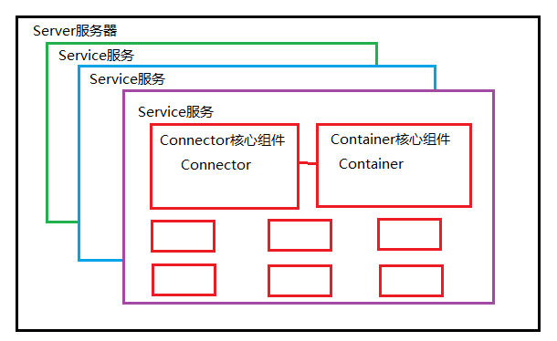
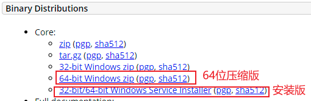
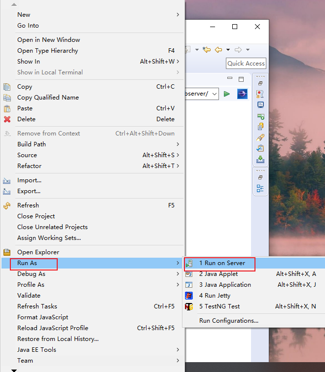

## 20210514学习笔记

### Tomcat的安装及配置

#### Tomcat介绍

**Tomcat**是基于Java语言的**WEB应用服务器**，是一款完全开源免费的Servlet器实现。同时，它也支持HTML、JS等静态资源的处理，因此又可以作为轻量级WEB服务器使用。

#### Tomcat原理

Tomcat 的心脏是两个组件：Connector 和 Container，一个 Container 可以选择对应多个 Connector。多个Connector 和一个 Container 就形成了一个 Service，有了 Service 就可以对外提供服务了，但是 Service 还要一个生存的环境，必须要有人能够给她生命、掌握其生死大权，那就非 Server 莫属了。所以整个 Tomcat 的生命周期由 Server 控制。

**Service 对于connector和container的关系**
Tomcat 中 Connector、Container 作为一个整体比作一对情侣的话，Connector 主要负责对外交流，Container 主要处理 Connector 接受的请求，主要是处理内部事务。那么这个 Service就是连接Connector和Container的桥梁。
Service 只是在 Connector 和 Container 外面多包一层，把它们组装在一起，向外面提供服务，一个 Service 可以设置多个Connector，但是只能有一个 Container 容器。

**Service接口**
Tomcat 中 Service 接口的标准实现类是 StandardService 它不仅实现了 Service 接口同时还实现了 Lifecycle 接口，这样它就可以控制它下面的组件的生命周期

**Connector 组件**
Connector 组件是 Tomcat 中两个核心组件之一，它的主要任务是负责接收浏览器的发过来的 tcp 连接请求，创建一个 Request 和 Response 对象分别用于和请求端交换数据，然后会产生一个线程来处理这个请求并把产生的 Request 和 Response 对象传给处理这个请求的线程，处理这个请求的线程就是 Container 组件要做的事了。
Connector 最重要的功能就是接收连接请求然后分配线程让 Container 来处理这个请求，所以这必然是多线程的，多线程的处理是 Connector 设计的核心

**Servlet 容器“Container”**
Container 是容器的父接口，所有子容器都必须实现这个接口，Container 容器的设计用的是典型的责任链的设计模式，它有四个子容器组件构成，分别是：Engine、Host、Context、Wrapper，这四个组件不是平行的，而是父子关系，Engine 包含Host,Host 包含 Context，Context 包含 Wrapper

**Tomcat 中其它组件**
Tomcat 还有其它重要的组件，如安全组件 security、logger 日志组件、session、mbeans、naming 等其它组件。这些组件共同为 Connector 和 Container 提供必要的服务。

#### Tomcat的安装及配置

1. 在下载Tomcat之前，要了解自己电脑上的Java版本，因为Tomcat的运行是依赖于JDK的支持，不同的Tomcat版本对应着不同的JDK版本，如果Tomcat版本和Java版本对应不上，就算安装好了Tomcat也会运行错误，下表为Tomcat版本和Java对应的版本：

| Java版本 | Tomcat版本 |
| :------: | :--------: |
| 8及更高  |   9.0.x    |
| 7及更高  |   8.5.x    |
| 7及更高  |   8.0.x    |
| 6及更高  |   7.0.x    |

2. 在[Tomcat官网](https://tomcat.apache.org/download-80.cgi)下载，我的电脑上的JDK版本为1.8，对应的Java版本是8，所以需要下载Tomcat8.5.66，官网上有压缩版，可以免安装。

3. 下载成功之后，进行解压缩，可以看到Tomcat的目录结构如下：

**bin目录：**是用来存放tomcat的命令。

**conf目录：**用来存放tomcat的配置文件。

- server.xml可以设置端口号、设置域名或IP、默认加载的项目、请求编码 

- web.xml可以设置tomcat支持的文件类型 

- context.xml可以用来配置数据源
- tomcat-users.xml用来配置管理tomcat的用户与权限

**lib目录：**用来存放tomcat运行需要加载的jar包。

**logs目录：**存放tomcat在运行过程中产生的日志文件。

**temp目录：**存放tomcat在运行过程中产生的临时文件（清空不会对tomcat带来影响）

**webapps目录：**用来存放应用程序，当tomcat启动时会去加载webapps目录下的应用程序。可以以文件夹、war包、jar包的形式发布应用。 

**work目录：****用来存放tomcat在运行时的编译后文件，例如JSP编译后的文件。
清空work目录，然后重启tomcat，可以达到清除缓存的作用。

4. 配置tomcat的环境变量，单击鼠标右键->属性->高级系统设置->环境变量->在系统变量中单击新建：

变量名中填写：CATALINA_HOME；变量值中填写：D:\development\tomcat8，然后确认。

5. 选中path变量，点击编辑，在弹出的编辑环境变量窗口中，添加以下内容：%CATALINA_HOME%\bin，然后确认保存。

6. 此时就可以测试Tomca是否可以正常运行了，打开tomcat的安装目录，然后进入bin目录，找到**tomcat8w.exe**，以管理元的身份运行，在弹出的窗口中选择Start，等待进度条加载完成

7. 打开浏览器，在地址栏输入localhost:8080，就会看到成功安装Tomcat的网页，此时就代表安装成功了。

### Ecplise创建WEB项目

#### 安装web项目插件

1. 在ecplise新建菜单中没有web的选项，首先打开help->install new software，
2. 在Install页面中Work with选项中，选择对应ecplise版本的下载地址，在刷新出来的选择框中选择Web,XML,Java EE and OSGi Enterprise Development，最后点击Finish，联网下载web相关插件，直至进度条完成。

此时就可以创建we项目了。

#### 创建Web项目

1. 点击File->new->other->web->Dynamic Web Project，点击Next。

2. 在New Dynamic Web Project中把要创建的项目进行设置，填写Project name，选择Project location，选择Target runtime，可以选择自己下载的Tomcat，找到安装目录即可，设置Dynamic web module version，最后点击Finish。

3. 在项目目录中找到WebContent，右键新建一个index.jsp文件

4. 编辑index.jsp文件

5. 在Package Explorer窗口，右键项目名称->Run As->Run On Server

6. 选择Tomcat v8.5 Server at loaclhost，点击Finish,开始执行。

7. 执行成功后，在浏览器地址栏输入：http://localhost:8080/webserver/，如果执行成功，会在浏览器看到以下信息：

